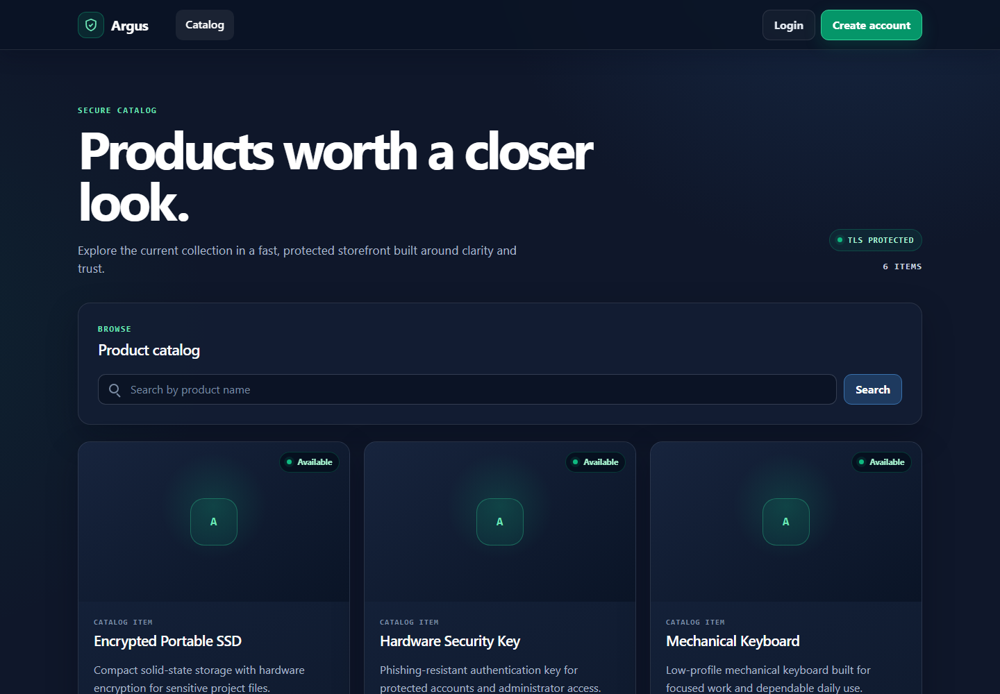
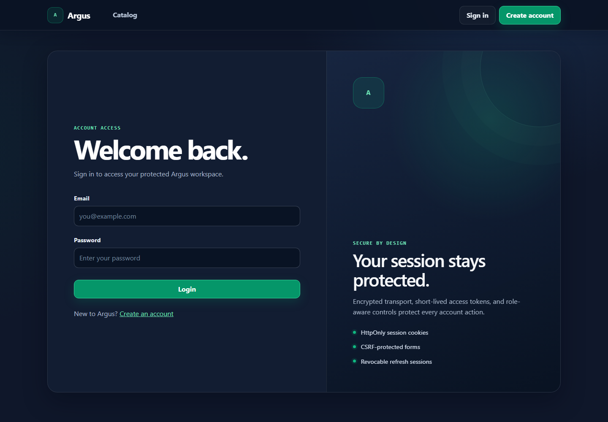
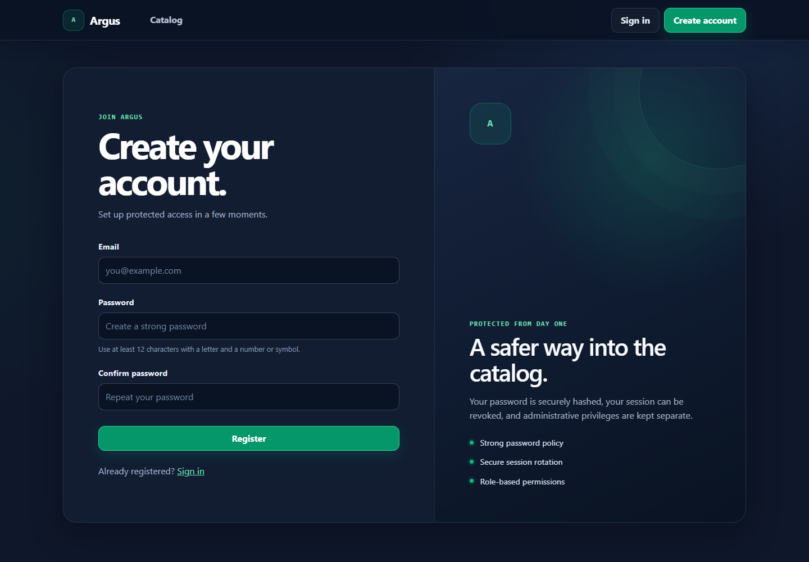
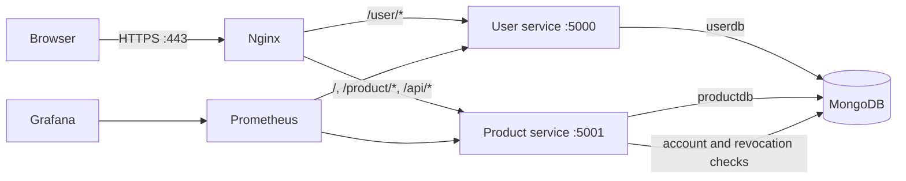

# Argus

Argus is a self-hosted product catalog with secure account access and role-based administration. It runs as two Flask services behind an Nginx TLS gateway, stores data in MongoDB, records privileged product changes, and exports Prometheus metrics.

## Screenshots

### Product catalog



### Account access

| Sign in | Create an account |
| --- | --- |
|  |  |

## Features

- Searchable and paginated public product catalog
- Product creation, editing, deletion, and image uploads
- Administrator dashboard with catalog metrics and an audit trail
- Account registration, secure sessions, password changes, and role management
- TLS termination, CSRF protection, JWT rotation, revocation, and rate limits
- Health checks, structured logs, Prometheus metrics, and a Grafana dashboard
- Responsive, accessible interfaces for desktop and mobile

## Architecture



Nginx exposes ports 80 and 443. MongoDB and both Flask services stay on an internal Docker network. The two services use separate `userdb` and `productdb` databases.

## Start the application

You need Docker with Compose v2 and OpenSSL.

Clone the repository:

```sh
git clone https://github.com/Pickachu19/Argus.git
cd Argus
```

Create the configuration, certificate, and containers:

```sh
cp .env.example .env
# Replace every change-me value in .env.
./scripts/generate-dev-cert.sh
docker compose up --build --wait
```

Open `https://localhost`. Your browser will warn about the development certificate because your machine does not trust its local certificate authority.

Create the first administrator after the stack becomes healthy:

```sh
docker compose run --rm user-service python create_admin.py
```

The bootstrap command reads `ADMIN_EMAIL`, `ADMIN_PASSWORD`, and `MONGO_URI` from the container environment. It rejects the placeholder password and requires the administrator to change the password after login.

### Environment variables

| Variable | Purpose |
| --- | --- |
| `SECRET_KEY` | Signs Flask sessions and CSRF tokens. Use at least 32 random bytes. |
| `JWT_SECRET_KEY` | Signs access and refresh JWTs. Keep it separate from `SECRET_KEY`. |
| `MONGO_ROOT_USERNAME`, `MONGO_ROOT_PASSWORD` | Authenticate the internal MongoDB connection. |
| `COOKIE_SECURE` | Keep `true` outside isolated HTTP tests. |
| `ACCESS_TOKEN_MINUTES` | Access-token lifetime. The default is 15 minutes. |
| `REFRESH_TOKEN_DAYS` | Refresh-token lifetime. The default is 7 days. |
| `MAX_UPLOAD_MB` | Maximum product image size. The default is 5 MB. |
| `ADMIN_EMAIL`, `ADMIN_PASSWORD` | Initial administrator bootstrap credentials. |

Compose reads `.env`; Git ignores the file. Do not commit production values.

## Routes

| Route | Access | Purpose |
| --- | --- | --- |
| `/` | Public | Searchable, paginated product catalog |
| `/api/products` | Public | JSON product API, capped at 100 results |
| `/product/add` | Admin | Add a product and optional image |
| `/product/manage` | Admin | Manage products and review recent activity |
| `/product/edit/<id>` | Admin | Edit a product |
| `/product/delete/<id>` | Admin, POST | Delete a product after modal confirmation |
| `/user/register`, `/user/login` | Public | Account registration and login |
| `/user/refresh` | Refresh cookie, POST | Rotate the access and refresh session |
| `/user/logout` | Authenticated, POST | Revoke the session and clear cookies |
| `/user/admin/users` | Admin | Manage roles, account status, and password reset flags |
| `/health`, `/product/health`, `/user/health` | Internal/public | Process liveness |
| `/ready`, `/product/ready`, `/user/ready` | Internal/public | Database readiness |
| `/metrics`, `/product/metrics`, `/user/metrics` | Internal/public | Prometheus metrics |

## TLS certificates

The development script creates `certs/dev.crt` and `certs/dev.key`; Git ignores both files. For a public deployment, obtain a certificate for your domain through your certificate authority or Certbot. Mount the full certificate chain and private key at the same container paths, or update `ssl_certificate` and `ssl_certificate_key` in `nginx.conf`. Remove the self-signed files from the host and keep the private key readable only by the deployment account.

HSTS tells browsers to require HTTPS for one year. Test the public certificate and redirect before you send production traffic to the gateway.

## Tests

Run each unit suite in an isolated environment:

```sh
python -m venv .venv
. .venv/bin/activate
pip install -r user-service/requirements.txt pytest pytest-cov
(cd user-service && pytest --cov=app)
pip install -r product-service/requirements.txt
(cd product-service && pytest --cov=app)
```

Run the full registration, login, RBAC, and product CRUD test against the stack:

```sh
pip install pytest requests beautifulsoup4
pytest tests/test_e2e.py -m integration
```

GitHub Actions runs lint, unit coverage, image builds, Trivy scans, and the Compose integration test on pushes and pull requests.

## Monitoring

Start Prometheus and Grafana with the optional profile:

```sh
docker compose --profile monitoring up -d
```

Open Grafana on `http://localhost:3000`. The provisioned dashboard shows request rate and p95 latency. Set non-placeholder Grafana credentials in `.env` before exposing port 3000.

## Security notes

The gateway terminates TLS, redirects HTTP, adds CSP and browser security headers, assigns request IDs, and rate-limits login, registration, and API traffic. The services set `Secure`, `HttpOnly`, and `SameSite=Lax` cookies. Flask-WTF protects forms, while Flask-JWT-Extended applies double-submit protection to JWT-authenticated POST requests.

The user service stores refresh-token state and revocation records in `userdb`; TTL indexes remove expired records. Product administration checks the current user record for each request, so a role change or account disable takes effect without waiting for the access-token claim to expire. Product changes create immutable audit records with the actor, request ID, target, and time.

Product uploads accept JPG, PNG, and WebP files under the configured size limit. A named Docker volume stores them. Use object storage with malware scanning, content re-encoding, retention rules, and backups when you deploy across more than one host.

The local Compose stack uses one MongoDB root credential. A public deployment should create one least-privilege database user per service, protect `/metrics` and readiness routes at the network layer, send logs to centralized storage, back up MongoDB and uploads, and manage keys through a secret manager. Rotate JWT keys through a planned deployment because rotation invalidates active sessions.

## Database indexes

The user service creates unique indexes on user email and token JTI fields, plus TTL indexes on refresh and revoked-token expiry. The product service indexes product name for search, audit time for the activity panel, and product ID plus audit time for investigations.

## Stop and remove local data

```sh
docker compose down
# Add -v only when you intend to delete MongoDB, upload, and Grafana volumes.
```

## Project layout

```text
.
├── .github/           GitHub Actions and Dependabot
├── certs/             Local certificate mount point
├── docs/screenshots/  Interface captures used in this README
├── monitoring/        Prometheus and Grafana configuration
├── product-service/   Catalog, uploads, administration, and audit records
├── scripts/           Development certificate generator
├── tests/             End-to-end Compose test
├── user-service/      Accounts, sessions, and user administration
├── .env.example       Environment-variable template
├── docker-compose.yml Local stack definition
└── nginx.conf         TLS gateway and security policy
```

## License

Argus is distributed under the terms in [LICENSE](LICENSE).
